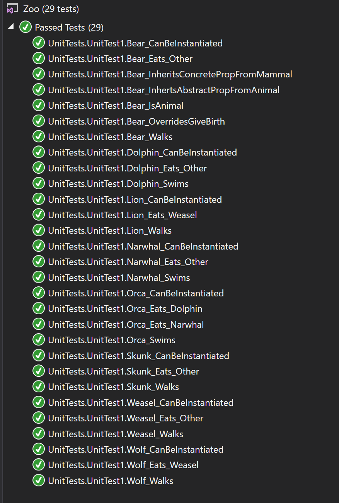
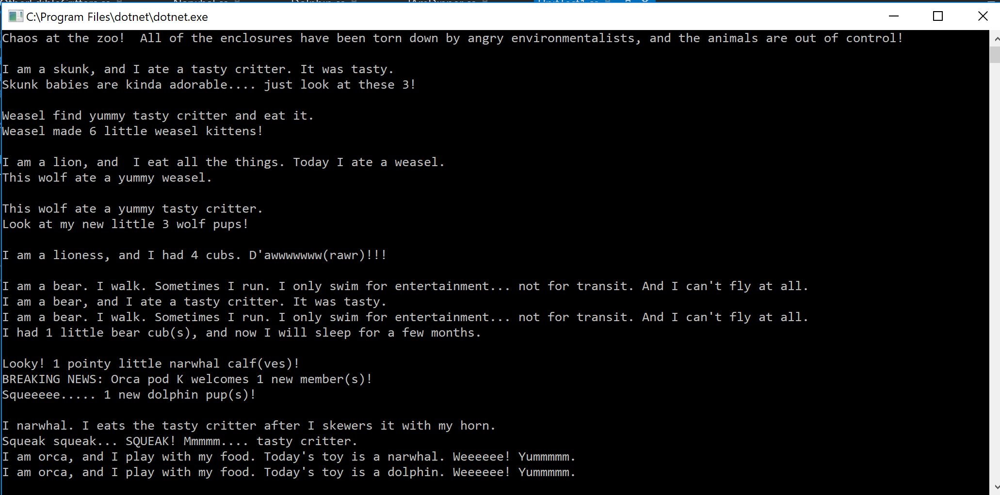

# Zoo
CF 401 - Lab: Zoo (OOP Principles)

## Background and Introduction
This project creates a set of classes (classification levels of animals) and interfaces (behaviors) that can be used to describe a zoo. The intent is to demonstrate the OOP principles (abstraction, inheritence, polymorphism, encapsulation) and the use of interfaces.

## Classes
Abstract classes are defined for each non-specific 'grouping' of animals with increasing specificity. Concrete classes are defined for species that are part of those groups. Classification hierarchy is maintained. 
IMAGE: Map of classes, with inheritance and abstraction.

## OOP Principles
INHERITANCE - This states that a class can be built from another (base) class, and in doing so, it 'inherits' all of its members (ie - properties, methods). 
  The Animal class is the 'base' class from which all of the individual animals inherit the properties Species, BodyCovering, etc. and the methods Eat and GiveBirth.
  Mammal (an Animal derivative) passes Travel and Hibernate to its 'child' classes.

POLYMORPHISM - This states that inherited properties and methods can (in certain cases) be altered (or overridden) once they by the class that derives them.
  The Mammal class changes BodyCovering to "hair", and passes that to its children.
  The Skunk class changes Stinky to 'true'. If Skunk had children, it would pass Stinky = true to its children, and a child could also change it back to 'false' (if it lacks scent glands).

ABSTRACTION - This states that a class or inherited property/method can exist for the sole purpose of passing on a template to deriving classes. It is something that is only used after inheritance. Concrete is the opposite of abstract - it's something that can get used at the level at which it's defined, and it absolutely MUST get defined at (or before) the concrete level at which it's instantiated. Virtual is the 'in between' answer - it *can* be overridden by children, but it doesn't have to be.
  Animal class is abstract. One can't build an 'Animal' instance directly - one needs the additional properties and methods that are 'built up' by the inheritance chain before there is an adequate template to build an instance. A Bear can be instantiated, and it includes all the properties and methods of all its ancestors (Carnivore, Mammal, and Animal), as well as any properties and methods that are introduced at its own level (none in this case, but we could add a uniquely bear-like property or method to Bear, and then only Bears have them).
  Species is an abstract property. Every instance of a concrete animal derivative has a species, and it *must* be overridden.
  HangsWithPosse is a virtual property. Every instance of a concrete derivative has this property, and it is defined by default as being 'true', but Bear overrides it... because it doesn't like others.

ENCAPSULATION - This states that content of all types is both grouped (logically, and per the coder's discretion) and access to that group is controlled as:
  - 'public' - any group (class) can access it 
      (all custom classes in this application are public)
  - 'private' - access is limited to inside the group (class) for which 'private' is specified
      (all backing stores in this application are private)
  - 'protected' - access is limited to inside the group (class) and any derivatives of it
      (not used in this application)

## Interfaces
Like classes, interfaces are collections of members that can be inherited by deriving classes. Like abstract classes, an interface can't be instantiated, and its members must be resolved before a concrete descendent is instantiated. Unlike abstract classes, an interface can contain only properties and methods, and it's intended to address *only* behaviors (rather than characteristics) of derived instances. Also unlike abstract classes, a deriving class can inherit from an unlimited number of interfaces (it isn't bound by the single inheritance rule governing classes). The real power of an interface is that it offers common (ie - library) behaviors that can enable interaction between objects of dissimilar classes.

In this project, interfaces are demonstrated through eating... every animal eats (using the 'IEat' interface), and some animals are tasty to others (as defined by the 'IAmDinner' interface).

IEat:  
This interface is implemented abstractly at the top level ('Animal' class). It is overridden by each species (not higher in the hierarchy because every species has its own dinner menu). As a parameter, it accepts/expects an edible animal (ie - one that has inherited 'IAmDinner').
  Example: Orca class inherits 'IEat' (indirectly) from Animal. It *must* eat, and it can eat any animal that is edible (ie - inherited 'IAmDinner').

IAmDinner:
This interface is implemented by each species directly (ie - there isn't another base class that groups *only* edible animals). Each implementing class contains some definition for how it gets eaten.
  Example: Narwhal class implements 'IAmDinner', so its type definition includes 'IAmDinner'. Orca can eat Narwhal by calling 'Eat(narwhal)' (where 'narwhal' is an instance of class Narwhal).

IMAGE: Map of classes, updated to include interfaces.

## Testing
The test suite verifies the following:
  - Each concrete class exhibits the inherited behaviors 'Eat' (from Animal class) and 'Travel' (from Mammal class)
  - Each implementation of the interfaces 'IEat' and 'IAmDinner' is successfully exercised
    *** 'IEat' forces the method 'Eat' into all in 'Animal' class, which is subsequently inherited by all. So interface implementation and method override are both proven by demonstrating 'Eat' by any inheriting/implementing class.***
  - Each concrete class inherits and overrides the property 'Species' (from Animal) on instantiation.
    *** These tests instantiate each concrete class as type 'Animal'. So the tests prove both that the property is inherited and overridden, and also that the object identifies as type 'Animal'. ***
  - Bear class successfully overrides the inherited virtual property 'HangsWithPosse'.
    *** This is overridden by other classes as well, but testing only proves the override for Bear. ***

## Results
Program.cs demonstrates class instantiation and interface implementation.

