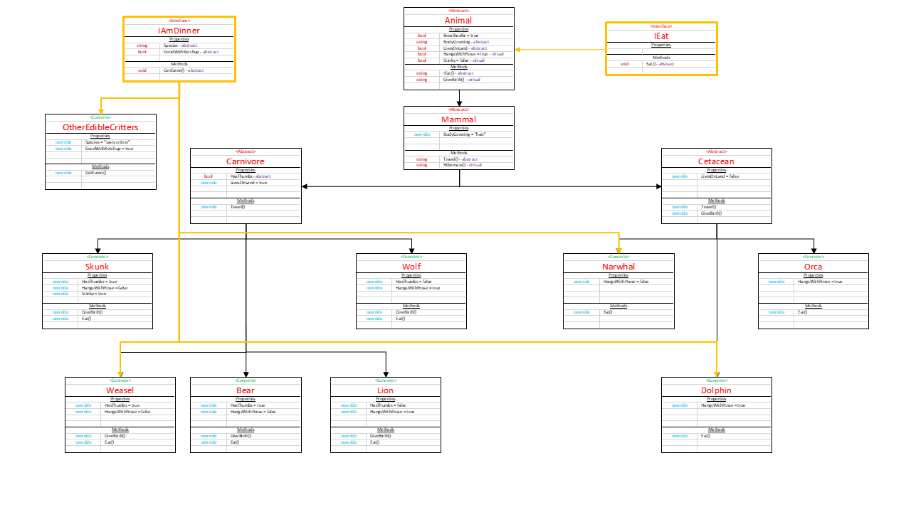

# Zoo
CF 401 - Lab: Zoo (OOP Principles)

## Background and Introduction
This project creates a set of classes (classification levels of animals) and interfaces (behaviors) that can be used to describe a zoo. The intent is to demonstrate the OOP principles (abstraction, inheritence, polymorphism, encapsulation) and the use of interfaces.

## Classes
Abstract classes are defined for each non-specific 'grouping' of animals with increasing specificity. Concrete classes are defined for species that are part of those groups. Classification hierarchy is maintained. 
IMAGE: Map of classes, with inheritance and abstraction.

## Interfaces
Like classes, interfaces are collections of members that can be inherited by deriving classes. Like abstract classes, an interface can't be instantiated, and its members must be resolved before a concrete descendent is instantiated. Unlike abstract classes, an interface can contain only properties and methods, and it's intended to address *only* behaviors (rather than characteristics) of derived instances. Also unlike abstract classes, a deriving class can inherit from an unlimited number of interfaces (it isn't bound by the single inheritance rule governing classes). The real power of an interface is that it offers common (ie - library) behaviors that can enable interaction between objects of dissimilar classes.

In this project, interfaces are demonstrated through eating... every animal eats (using the 'IEat' interface), and some animals are tasty to others (as defined by the 'IAmDinner' interface).

IEat:  
This interface is implemented abstractly at the top level ('Animal' class). It is overridden by each species (not higher in the hierarchy because every species has its own dinner menu). As a parameter, it accepts/expects an edible animal (ie - one that has inherited 'IAmDinner').
  Example: Orca class inherits 'IEat' (indirectly) from Animal. It *must* eat, and it can eat any animal that is edible (ie - inherited 'IAmDinner').

IAmDinner:
This interface is implemented by each species directly (ie - there isn't another base class that groups *only* edible animals). Each implementing class contains some definition for how it gets eaten.
  Example: Narwhal class implements 'IAmDinner', so its type definition includes 'IAmDinner'. Orca can eat Narwhal by calling 'Eat(narwhal)' (where 'narwhal' is an instance of class Narwhal).

IMAGE: Map of classes, updated to include interfaces.

## Testing
The test suite confirms that inheritence and polymorphism are evident in the classes, that all concrete classes can be instantiated, and that interface are properly implemented.

## Results
Program.cs demonstrates class instantiation and interface implementation.

